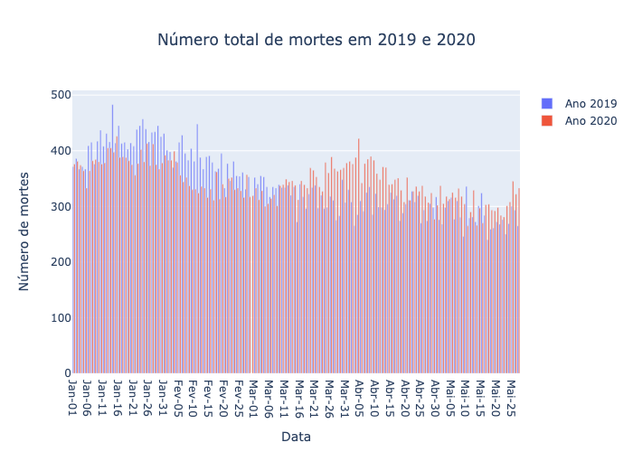

# Trabalho final #

A covid-19 é uma doença infeciosa causada pelo coronavirus da Sindrome Respiratória Aguda Grave 2 (SARS-CoV-2). Este vírus foi identificado pela primeira vez em seres humanos em dezembro de 2019 em Wuhan, na China. Este surto inicial deu origem a uma pandemia global provocando, até à data de hoje, milhões de casos confirmados e milhares de mortes em todo o mundo.

Para além de provocar vítimas, esta pandemia também provocou impactos económicos quando os países tiveram de entrar em estado de emergência, fechando escolas, empresas, centros comerciais. 

Assim, este trabalho divide-se em duas partes. Numa primeira parte analisaram-se os impactos desta pandemia no número de mortes, no PIB, nas empresas, no preço do petróleo, no turismo, no demprego e na venda de veículos, tendo sido analisadas estas estatísticas em Portugal. Numa segunda parte, criaram-se mapas relativos ao número de novos casos positivos por dia, ao número de mortes e número de casos positivos no todas, mas em relação a Itália.

## - Impacto da Covid-19 em Portugal ##

Os dados relativos ao impacto da Covid-19 em Portugal foram retirados da plataforma [SICO](https://evm.min-saude.pt/) que atualiza dos seus dados relativos ao número de mortes em Portugal a cada 10 minutos. A maior parte dos dados foram retirados da plataforma [PORDATA](https://www.pordata.pt/) que criou uma nova área denominada [Números da crise](https://www.pordata.pt/NumerosDaCrise) que, reúne dezenas de indicadores-chave de fontes estatísticas diferentes para  analisar da melhor forma os impactos económicos e sociais da Covid-19 na vida dos portugueses desde Março de 2020. Por último foram também utilizados dados presentes no [Instituto Nacional de Estatística (INE)](https://www.ine.pt/xportal/xmain?xpgid=ine_main&xpid=INE).

#### 1. Impacto no número de mortes ####

Quanto ao número de mortes, foram criados dois gráficos.
Um primeiro em que, se compararam o número total de mortes no ano de 2019 e no ano de 2020:

